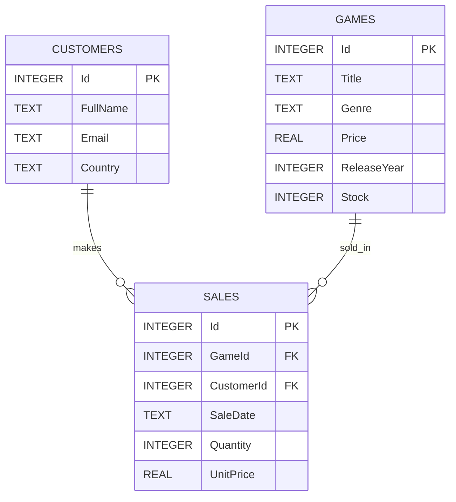

# Game Store Database

## 1. Inledning

I detta projekt har jag designat och skapat en relationsdatabas för en fiktiv spelbutik, alltså en Game Store. Databasen används för att lagra information om spel, kunder och försäljningar. Syftet är att visa hur man kan skapa tabeller, koppla dem med relationer, lägga in data och använda SQL för CRUD-operationer: Create, Read, Update och Delete.

Databasen består av tre huvudtabeller:

* Games
* Customers
* Sales

Sales-tabellen fungerar som en koppling mellan kunder och spel, eftersom en kund kan köpa flera spel och ett spel kan säljas flera gånger.

---

<div style="page-break-before: always;"></div>

## 2. ER-diagram



En förenklad version av relationerna är:

Customers 1 ---- N Sales N ---- 1 Games

---

## 3. Förklaring av tabeller

### Games

Tabellen Games innehåller information om spelen som säljs i butiken.

Kolumner:

* Id: Primärnyckel som identifierar varje spel.
* Title: Spelets titel.
* Genre: Spelets genre, till exempel RPG eller Sports.
* Price: Spelets pris.
* ReleaseYear: Året spelet släpptes.
* Stock: Hur många exemplar som finns i lager.

Jag valde TEXT för textdata, REAL för pris eftersom priser kan innehålla decimaler, och INTEGER för heltal som Id, ReleaseYear och Stock.

### Customers

Tabellen Customers innehåller information om kunder.

Kolumner:

* Id: Primärnyckel som identifierar varje kund.
* FullName: Kundens namn.
* Email: Kundens e-postadress.
* Country: Kundens land.

Email har constraint UNIQUE eftersom två kunder inte bör ha samma e-postadress.

### Sales

Tabellen Sales innehåller information om köp/försäljningar.

Kolumner:

* Id: Primärnyckel för varje försäljning.
* GameId: Foreign key som kopplar försäljningen till ett spel.
* CustomerId: Foreign key som kopplar försäljningen till en kund.
* SaleDate: Datumet då köpet gjordes.
* Quantity: Hur många exemplar kunden köpte.
* UnitPrice: Priset per exemplar vid försäljningstillfället.

Sales använder foreign keys för att koppla ihop Games och Customers.

---

## 4. Relationer

Relationen mellan Customers och Sales är 1-N. Det betyder att en kund kan ha flera försäljningar, men varje försäljning hör till en kund.

Relationen mellan Games och Sales är också 1-N. Det betyder att ett spel kan säljas flera gånger, men varje försäljning gäller ett specifikt spel.

Tillsammans skapar detta en N-N-relation mellan Customers och Games via Sales. En kund kan köpa flera spel, och samma spel kan köpas av flera kunder.

---

## 5. Motivering av constraints

Jag använder PRIMARY KEY på varje tabell för att varje rad ska kunna identifieras unikt. Jag använder FOREIGN KEY i Sales för att säkerställa att varje försäljning måste vara kopplad till ett riktigt spel och en riktig kund.

Jag använder NOT NULL på viktiga kolumner eftersom till exempel ett spel måste ha titel, pris och genre. Jag använder CHECK på Price, Stock och Quantity för att undvika orimliga värden, till exempel negativa priser eller negativt lager. Jag använder UNIQUE på Email för att undvika att flera kunder får samma e-postadress.

---

# SQL-kommandon

## 6. create_tables.sql

```sql
PRAGMA foreign_keys = ON;

DROP TABLE IF EXISTS Sales;
DROP TABLE IF EXISTS Customers;
DROP TABLE IF EXISTS Games;

CREATE TABLE Games (
    Id INTEGER PRIMARY KEY AUTOINCREMENT,
    Title TEXT NOT NULL,
    Genre TEXT NOT NULL,
    Price REAL NOT NULL CHECK (Price >= 0),
    ReleaseYear INTEGER NOT NULL CHECK (ReleaseYear >= 1970),
    Stock INTEGER NOT NULL CHECK (Stock >= 0)
);

CREATE TABLE Customers (
    Id INTEGER PRIMARY KEY AUTOINCREMENT,
    FullName TEXT NOT NULL,
    Email TEXT NOT NULL UNIQUE,
    Country TEXT NOT NULL
);

CREATE TABLE Sales (
    Id INTEGER PRIMARY KEY AUTOINCREMENT,
    GameId INTEGER NOT NULL,
    CustomerId INTEGER NOT NULL,
    SaleDate TEXT NOT NULL,
    Quantity INTEGER NOT NULL CHECK (Quantity > 0),
    UnitPrice REAL NOT NULL CHECK (UnitPrice >= 0),

    FOREIGN KEY (GameId) REFERENCES Games(Id),
    FOREIGN KEY (CustomerId) REFERENCES Customers(Id)
);
```

---

## 7. insert_data.sql

```sql
PRAGMA foreign_keys = ON;

INSERT INTO Games (Title, Genre, Price, ReleaseYear, Stock) VALUES
('Elden Ring', 'RPG', 599, 2022, 12),
('Minecraft', 'Sandbox', 299, 2011, 25),
('FIFA 24', 'Sports', 699, 2023, 8),
('Cyberpunk 2077', 'RPG', 399, 2020, 10),
('Stardew Valley', 'Simulation', 149, 2016, 30),
('The Witcher 3', 'RPG', 249, 2015, 15);

INSERT INTO Customers (FullName, Email, Country) VALUES
('Adam Svensson', 'adam@email.com', 'Sweden'),
('Sara Nilsson', 'sara@email.com', 'Sweden'),
('Erik Johansson', 'erik@email.com', 'Norway'),
('Nora Andersson', 'nora@email.com', 'Denmark');

INSERT INTO Sales (GameId, CustomerId, SaleDate, Quantity, UnitPrice) VALUES
(1, 1, '2026-05-01', 1, 599),
(2, 1, '2026-05-02', 2, 299),
(3, 2, '2026-05-03', 1, 699),
(4, 3, '2026-05-04', 1, 399),
(5, 4, '2026-05-05', 3, 149),
(6, 2, '2026-05-06', 1, 249);
```

---

## 8. select_basic.sql

```sql
-- 1. Visa alla spel
SELECT * FROM Games;

-- 2. Visa spel som kostar mer än 300
SELECT * 
FROM Games
WHERE Price > 300;

-- 3. Visa alla RPG-spel
SELECT *
FROM Games
WHERE Genre = 'RPG';

-- 4. Visa spel sorterade efter pris, billigast först
SELECT *
FROM Games
ORDER BY Price ASC;

-- 5. Sök efter spel som innehåller bokstaven e
SELECT *
FROM Games
WHERE Title LIKE '%e%';

-- 6. Räkna antal spel per genre
SELECT Genre, COUNT(*) AS NumberOfGames
FROM Games
GROUP BY Genre;

-- 7. Visa genomsnittspris per genre
SELECT Genre, AVG(Price) AS AveragePrice
FROM Games
GROUP BY Genre;
```

---

## 9. select_join.sql

```sql
-- 1. Visa försäljningar med kundnamn och speltitel
SELECT 
    Sales.Id,
    Customers.FullName,
    Games.Title,
    Sales.Quantity,
    Sales.UnitPrice,
    Sales.SaleDate
FROM Sales
JOIN Customers ON Sales.CustomerId = Customers.Id
JOIN Games ON Sales.GameId = Games.Id;

-- 2. Visa hur mycket varje kund har spenderat totalt
SELECT 
    Customers.FullName,
    SUM(Sales.Quantity * Sales.UnitPrice) AS TotalSpent
FROM Sales
JOIN Customers ON Sales.CustomerId = Customers.Id
GROUP BY Customers.FullName;

-- 3. Visa hur många exemplar som sålts av varje spel
SELECT 
    Games.Title,
    SUM(Sales.Quantity) AS TotalSold
FROM Sales
JOIN Games ON Sales.GameId = Games.Id
GROUP BY Games.Title;
```

---

## 10. updates.sql

```sql
-- 1. Höj priset på Elden Ring
UPDATE Games
SET Price = Price + 50
WHERE Id = 1;

-- 2. Uppdatera lagersaldo efter försäljning
UPDATE Games
SET Stock = Stock - 1
WHERE Id = 1;
```

---

## 11. deletes.sql

```sql
PRAGMA foreign_keys = ON;

-- Tar bort en försäljningsrad
DELETE FROM Sales
WHERE Id = 6;
```

---

# 12. Jämförelse mellan SQL och LINQ

## Exempel 1: Filtrera spel efter pris

SQL:

```sql
SELECT * 
FROM Games
WHERE Price > 300;
```

LINQ:

```csharp
var result = Games
    .Where(game => game.Price > 300)
    .ToList();
```

Förklaring:

I SQL används WHERE för att filtrera rader där priset är större än 300. I LINQ används .Where() för samma sak. Tabellen Games motsvarar samlingen Games i C#, och kolumnen Price motsvarar egenskapen game.Price.

---

## Exempel 2: Sortera spel efter pris

SQL:

```sql
SELECT *
FROM Games
ORDER BY Price ASC;
```

LINQ:

```csharp
var result = Games
    .OrderBy(game => game.Price)
    .ToList();
```

Förklaring:

I SQL används ORDER BY för att sortera resultatet. I LINQ används .OrderBy(). ASC betyder stigande ordning, vilket också är standard i LINQ när man använder OrderBy.

---

## Exempel 3: Räkna antal spel per genre

SQL:

```sql
SELECT Genre, COUNT(*) AS NumberOfGames
FROM Games
GROUP BY Genre;
```

LINQ:

```csharp
var result = Games
    .GroupBy(game => game.Genre)
    .Select(group => new
    {
        Genre = group.Key,
        NumberOfGames = group.Count()
    })
    .ToList();
```

Förklaring:

I SQL används GROUP BY för att gruppera spelen efter Genre, och COUNT(*) räknar hur många spel som finns i varje grupp. I LINQ används .GroupBy() för att skapa grupper och .Count() för att räkna objekten i varje grupp. group.Key motsvarar genren.

---

# 13. Säkerhet

Säker åtkomst till databaser är viktigt eftersom databaser ofta innehåller känslig information, till exempel kunduppgifter, e-postadresser och köphistorik. Authentication betyder att systemet kontrollerar vem användaren är, till exempel genom inloggning med användarnamn och lösenord. Authorization betyder att systemet kontrollerar vad användaren har rätt att göra efter att personen har loggat in. En vanlig användare ska till exempel inte kunna ta bort hela databasen eller läsa administratörsdata. I ett backendprojekt kan man skydda känslig data genom att använda säkra lösenord, hashning, parametriserade SQL-frågor och begränsade databasrättigheter. Man bör också undvika att spara hemligheter, som lösenord eller API-nycklar, direkt i koden. Det är också viktigt att validera indata för att minska risken för SQL-injection och felaktiga värden i databasen.

---

# 14. Versionshantering

Jag har organiserat projektet genom att lägga alla SQL-filer i en separat sql-mapp. Detta gör projektet tydligare eftersom varje fil har ett eget ansvar: skapa tabeller, lägga in data, läsa data, kombinera tabeller, uppdatera data och ta bort data.

Versionshantering med Git är viktigt i databasutveckling eftersom man kan följa förändringar i databasstrukturen över tid. Om något blir fel kan man gå tillbaka till en tidigare version. Det blir också lättare att samarbeta med andra, eftersom flera personer kan arbeta med olika delar och sedan slå ihop ändringarna. Bra commit-meddelanden gör det enklare att förstå vad som har ändrats och varför. Exempel på commits i detta projekt kan vara “Create database tables”, “Insert test data”, “Add select queries” och “Add report”.

---

# 15. Reflektion

Arbetet gick bra eftersom databasen har en tydlig struktur med tre tabeller och enkla relationer. Det var lätt att förstå hur Sales-tabellen kopplar ihop Customers och Games. JOIN-frågorna var viktiga eftersom de visade hur data från flera tabeller kan kombineras för att ge mer användbar information, till exempel vilka kunder som köpt vilka spel.

Det svåraste var att tänka igenom relationerna och se till att foreign keys användes korrekt. Det var också viktigt att testa SQL-filerna i rätt ordning, eftersom tabellerna måste skapas innan data kan läggas in. En förbättring hade varit att lägga till fler tabeller, till exempel Categories, Employees eller PaymentMethods, för att göra databasen mer realistisk. Man skulle också kunna bygga ett enkelt backendprogram i C# som använder databasen och LINQ mer praktiskt.

Sammanfattningsvis visar projektet hur man kan designa en enkel relationsdatabas, använda CRUD-kommandon och skriva queries med både SELECT och JOIN. Projektet visar också varför struktur, säkerhet och versionshantering är viktiga delar av databasutveckling.
